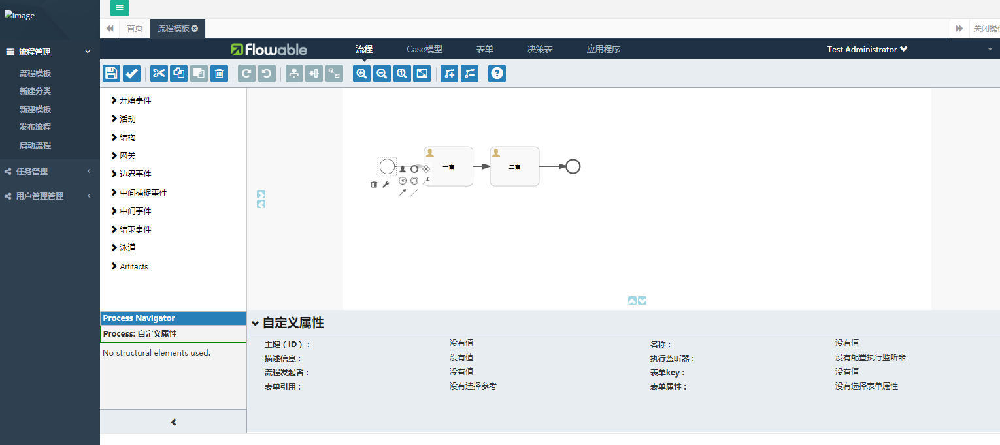

------

环境：

[jkd8+]()

[Flowable6.4.0]()

[mysql5.6+]()

[spring boot2.0.7]()

------

## 一、整合spring boot

新建springboot项目

## 二、整合flowable-modeler

- [详见flowable-project](https://gitee.com/flowable-project/springboot-flowable-ui)


## 三、创建数据库

- ​	修改配置

```
根据/src/main/resources/application.properties配置的环境，修改对应的/src/main/resources/application-dev.properties或/src/main/resources/application-test.properties中数据源的配置。
```

- 执行脚本

  先创建对于数据库application-{PROFILE}.properties

```
执行src/main/resources/db/init.sql
```


## 四、启动

- 登陆用户名/密码：admin/test

- 浏览器访问：http://localhost:9999/

  提供了简单的流程定义和部署，界面比较丑，主要用来学习的

  


## 五、新增用户节点自定义扩展属性

- 在stencilset_bpmn.json中新增属性
- 自定义处理类---控制类CustomAbstractModelBpmnResource继承AbstractModelBpmnResource
- 修改导出流程请求的URL

```
/src/main/resources/static/modeler/scripts/configuration/url-config.js
中将getModelBpmn20ExportUrl中的url改成CustomAbstractModelBpmnResource中的url
```

- 自定义UserTask解析器CustomUserTaskJsonConverter解析自定义字段